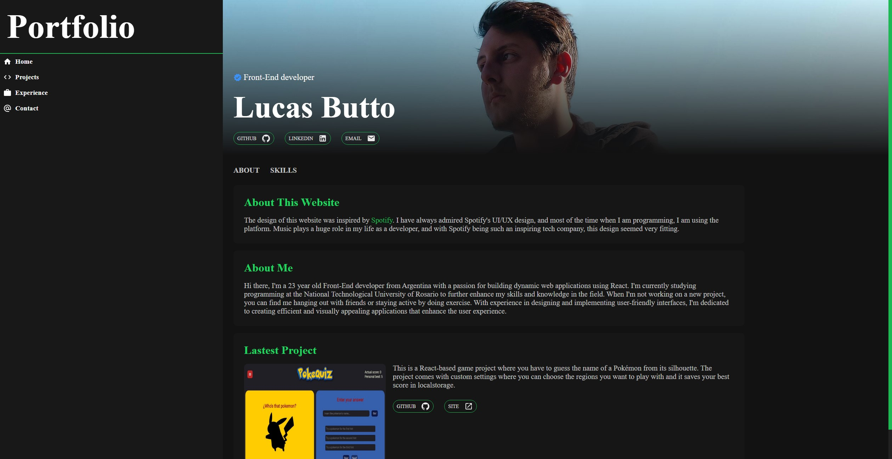

# Portafolio Spotify Based

This project consists of a responsive portfolio built in React, which was inspired by the user interface and user experience of Spotify. The main objective of the project is to showcase my skills as a developer and allow visitors to explore my projects, experience, and get in touch with me.

## Pages

The portfolio consists of four distinct pages:
- <b>Home:</b> The main page where information about me, my skills, and experience can be found.
- <b>Projects:</b> A page where all the projects I have worked on can be explored. Details such as the technology used and the results obtained are displayed.
- <b>Experience:</b> A page where information about my education, previous work experience, and professional career as a developer can be found.
- <b>Contact:</b> A page with a form to get in touch with me in case of any questions about my experience or skills or if anyone would like to work with me on a project.

## Technologies Used

The portfolio was built using React DOM, which makes it highly interactive and responsive on all devices. In addition, other technologies such as HTML, CSS, and JavaScript were used.

## How to Use the Project

1. Clone the repository
2. Install the project dependencies using the command 
    > npm install
3. Run the project using the command 
    > npm start
4. Navigate through the portfolio and explore the different pages.

## Contribution

Contributions are welcome and can be made through pull requests. If you would like to contribute, please create a branch and make your changes in that branch. Make sure the changes are relevant and well-documented.

## Author

This project was developed by me, Butto Lucas. If you have any questions or comments about the project, please do not hesitate to get in touch with me through the contact form or via my GitHub profile.

## Screenshot

    

## Test Project

> https://portfolio-lucasbutto.vercel.app/
