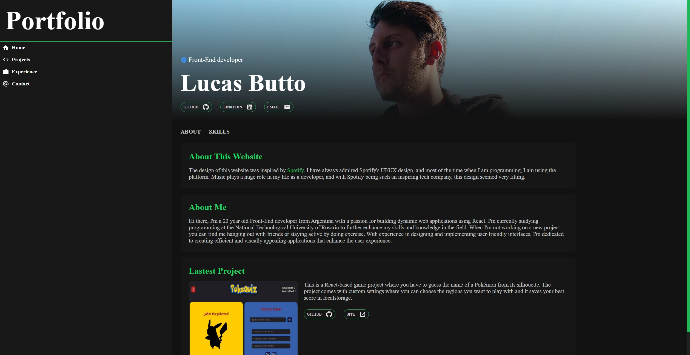

# Portfolio Spotify Based

Personal portfolio built with React, TypeScript, Vite and Sass, inspired by the
Spotify interface. Everything lives on a single page: a fixed sidebar, a
scrollable content stage and a player bar that "plays" the projects.

## Sections

- **Home:** artist-style header with the profile, links and resume.
- **About:** summary and quick stats (experience, projects, technologies).
- **Skills:** technologies grouped by category, each one linking to its docs.
- **Experience:** work history rendered as a track list, with computed durations.
- **Projects:** grid of covers; clicking a card opens the project detail modal
  and loads it into the player bar.
- **Education:** academic background.

## Tech stack

- React 18 + TypeScript
- Vite
- Sass (one `.scss` file per component + shared tokens/mixins)
- MUI icons

## Project structure

```
public/            images, project covers and technology logos
src/
├─ components/     one folder per component with its .tsx and .scss
├─ context/        player state (current project, play/pause, modal)
├─ data/           profile, skills, experience, projects and education
├─ hooks/          usePlayer
├─ i18n/           interface copy for both languages
├─ styles/         tokens, variables, mixins and global styles
├─ types/          shared TypeScript types
└─ utils/          date helpers
```

## How to Use the Project

1. Clone the repository
2. Install the project dependencies using the command
   > npm install
3. Run the project using the command
   > npm run dev
4. Open the local URL and scroll through the portfolio.

Other useful scripts: `npm run build`, `npm run lint`, `npm run type-check`.

## Contribution

Contributions are welcome and can be made through pull requests. If you would
like to contribute, please create a branch and make your changes in that branch.
Make sure the changes are relevant and well-documented.

## Author

This project was developed by me, Butto Lucas. If you have any questions or
comments about the project, please do not hesitate to get in touch with me
through my GitHub profile.

## Screenshot

<p align="center">
    
</p>

## Test Project

> https://portfolio-lucasbutto.vercel.app/
